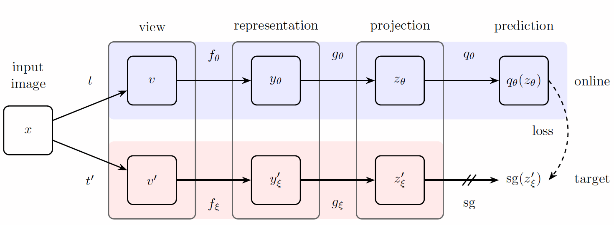

> Last update on 17 Sep 2021 

Bootstrap Your Own Latent (BYOL) is an approach to self-supervised learning. BYOL’s goal is to learn a representation $y_θ$ which can then be used for downstream tasks. BYOL uses two neural networks to learn: the online and target networks. The online network is defined by a set of weights $θ$ and is comprised of three stages: an encoder $f_θ$, a projector $g_θ$ and a predictor $q_θ$. The target network has the same architecture as the online network, but uses a different set of weights $ξ$. The target network provides the regression targets to train the online network, and its parameters $\xi$ are an exponential moving average of the online parameters $\theta$.

Given the architecture diagram on the right, BYOL minimizes a similarity loss between $q_{\theta}\left(z_{\theta}\right)$ and $s g\left(z_{\xi}^{\prime}\right)$, where $\theta$ are the trained weights, $\xi$ are an exponential moving average of $θ$ and $sg$ means stop-gradient. At the end of training, everything but $f_θ$ is discarded, and $y_θ$ is used as the image representation. Batch Normalization is the key, contrasive happen here. Removal from either one network reduces the performance, and removal from both make the architecture not working. *Some works later show that the keys are stop gradient and asymmetrical update, not batch normalization*.

Pro
- No negative sample is needed (no contrastive).
- Simple architecture that learns good representation, result in satisfying results.

Con
- Expensive computation (long hours of training).
- Hard to replicate, the details are missed out.

Taken from:
1. [Grill, Jean-Bastien, et al. "Bootstrap your own latent: A new approach to self-supervised learning." arXiv preprint arXiv:2006.07733 (2020)](https://arxiv.org/abs/2006.07733)
2. [papers with code](https://paperswithcode.com/method/byol)
3. [未来亦可期-CV on bilibili](https://www.bilibili.com/video/BV15D4y1d7GQ)
4. [Yannic Kilcher on Youtube](https://www.youtube.com/watch?v=YPfUiOMYOEE)